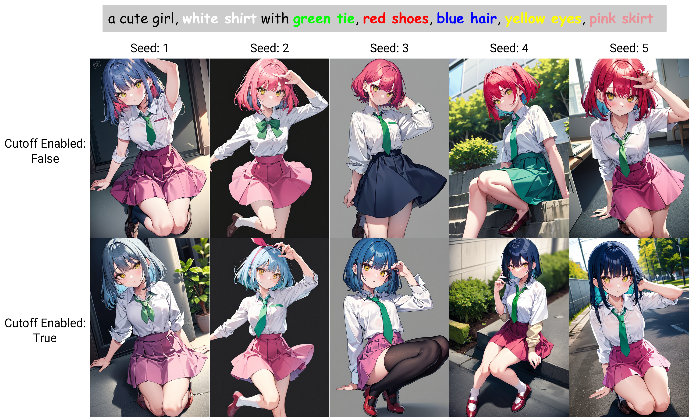
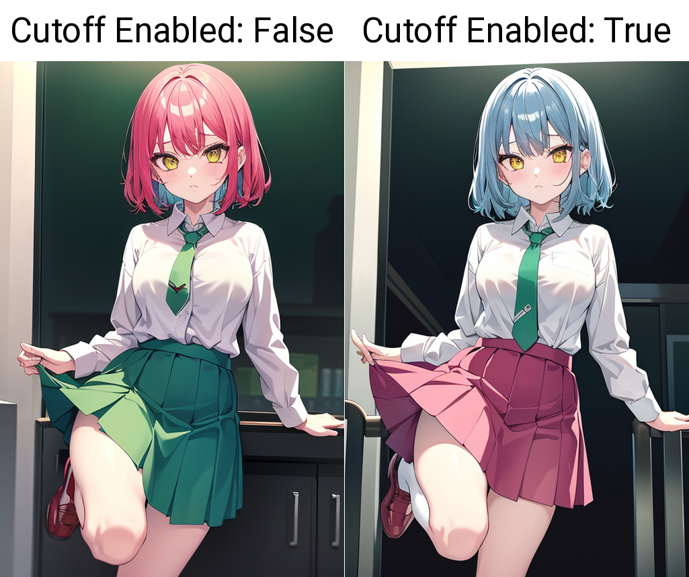
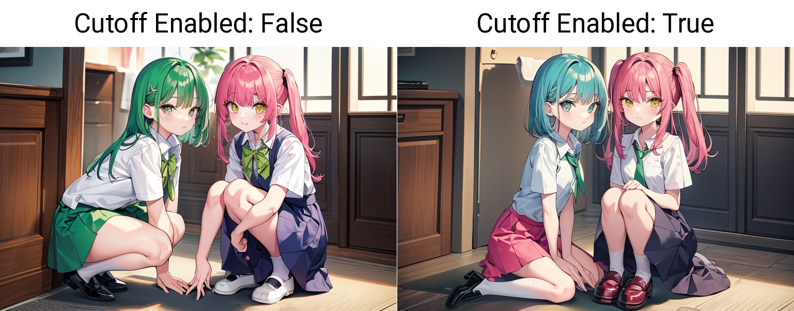
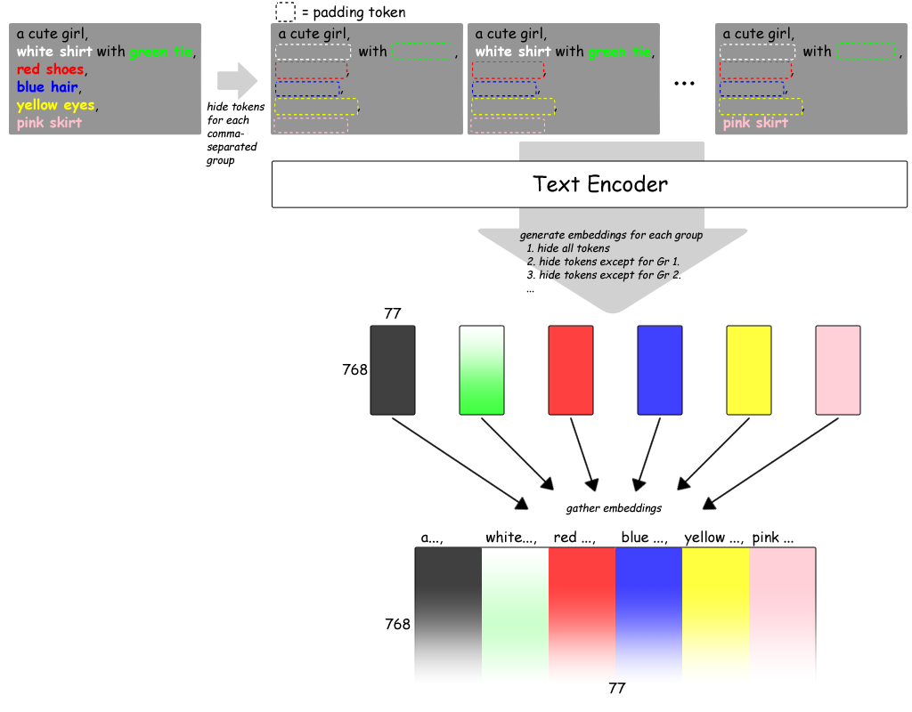

# Cutoff - Cutting Off Prompt Effect



<details>
<summary>Update Info</summary>

Upper is newer.

<dl>
<dt>20e87ce264338b824296b7559679ed1bb0bdacd7</dt>
<dd>Skip empty targets.</dd>
<dt>03bfe60162ba418e18dbaf8f1b9711fd62195ef3</dt>
<dd>Add <code>Disable for Negative prompt</code> option. Default is <code>True</code>.</dd>
<dt>f0990088fed0f5013a659cacedb194313a398860</dt>
<dd>Accept an empty prompt.</dd>
</dl>
</details>

## What is this?

This is an extension for [stable-diffusion-webui](https://github.com/AUTOMATIC1111/stable-diffusion-webui) which limits the tokens' influence scope.

## Usage

1. Select `Enabled` checkbox.
2. Input words which you want to limit scope in `Target tokens`.
3. Generate images.

## Note

If the generated image was corrupted or something like that, try to change the `Weight` value or change the interpolation method to `SLerp`. Interpolation method can be found in `Details`.

## Examples

```
7th_anime_v3_A-fp16 / DPM++ 2M Karras / 15 steps / 512x768
Prompt: a cute girl, white shirt with green tie, red shoes, blue hair, yellow eyes, pink skirt
Negative Prompt: (low quality, worst quality:1.4), nsfw
Target tokens: white, green, red, blue, yellow, pink
```






## How it works



### Japanese

プロンプトをCLIPに通して得られる (77, 768) 次元の埋め込み表現（？正式な用語は分かりません）について、
ごく単純には、77個の行ベクトルはプロンプト中の75個のトークン（＋開始トークン＋終了トークン）に対応していると考えられる。

※上図は作図上、この説明とは行と列を入れ替えて描いている。

このベクトルには単語単体の意味だけではなく、文章全体の、例えば係り結びなどの情報を集約したものが入っているはずである。

ここで `a cute girl, pink hair, red shoes` というプロンプトを考える。
普通、こういったプロンプトの意図は

1. `pink` は `hair` だけに係っており `shoes` には係っていない。
2. 同様に `red` も `hair` には係っていない。
3. `a cute girl` は全体に係っていて欲しい。`hair` や `shoes` は女の子に合うものが出て欲しい。

……というもののはずである。

しかしながら、[EvViz2](https://github.com/hnmr293/sd-webui-evviz2) などでトークン間の関係を見ると、そううまくはいっていないことが多い。
つまり、`shoes` の位置のベクトルに `pink` の影響が出てしまっていたりする。

一方で上述の通り `a cute girl` の影響は乗っていて欲しいわけで、どうにかして、特定のトークンの影響を取り除けるようにしたい。

この拡張では、指定されたトークンを *padding token* に書き換えることでそれを実現している。

たとえば `red shoes` の部分に対応して `a cute girl, _ hair, red shoes` というプロンプトを生成する。`red` と `shoes` に対応する位置のベクトルをここから生成したもので上書きしてやることで、`pink` の影響を除外している。

これを `pink` の側から見ると、自分の影響が `pink hair` の範囲内に制限されているように見える。What is this? の "limits the tokens' influence scope" はそういう意味。

ところで `a cute girl` の方は、`pink hair, red shoes` の影響を受けていてもいいし受けなくてもいいような気がする。
そこでこの拡張では、こういうどちらでもいいプロンプトに対して

1. `a cute girl, pink hair, red shoes`
2. `a cute girl, _ hair, _ shoes`

のどちらを適用するか選べるようにしている。`Details` の `Cutoff strongly` がそれで、オフのとき1.を、オンのとき2.を、それぞれ選ぶようになっている。
元絵に近いのが出るのはオフのとき。デフォルトもこちらにしてある。
